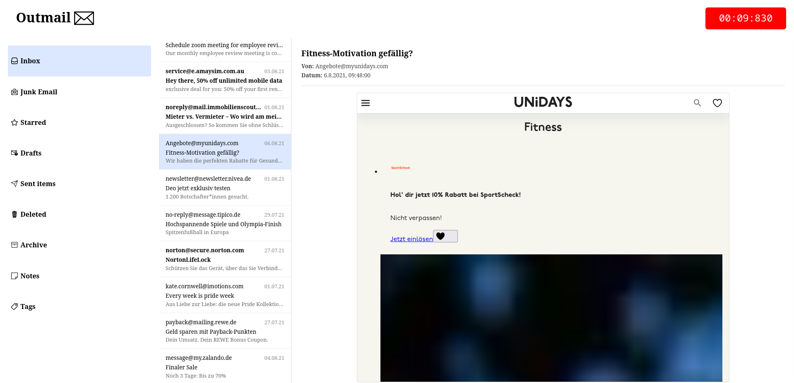
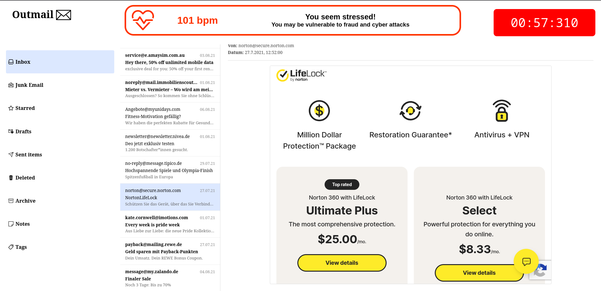

# Installation and Setup
[Intallation and setup guidelines for Fedora, Ubuntu and Windows 11](https://github.com/FiedlerInformatics/phishing-study/blob/main/installation.md)

# Frontend






# Documentation
## Emails
Emails are stored in `./frontend/src/lib/emails.json` with the following structure, defined in `./frontend/src/lib/types.ts` :
``` ts
export type EmailCategory = 'advertising' | 'neutral' | 'urgent';
export type PhishingCategory =
    'shared document' | 'new regulation' | 'request for password reset' |
    'evaluation form' | 'employee survey' | 'account validation' |
    'lottery' | 'party invitation' | 'extending software license'
    ;
export type ManipulationTechnique = 'stress' | 'authority' | 'helpfulness' | 'reward' | null;
export type Difficulty = 'easy' | 'medium' | 'hard';
export type MimickedWebsite = 'dropbox' | 'apple' | 'microsoft' | 'skype'

export interface BodyBlock {
  type: string;
  content: string;
}

export interface Email {
  id: number;
  sender: string;
  subject: string;
  timestamp: string;
  preview: string;
  body: BodyBlock;
  folder: string;
  isPhishing: boolean;
  read: boolean;
  
  senderSpoofed: boolean;
  
  emailCategory: EmailCategory;
  phishingCategory: PhishingCategory;
  manipulationTechnique: ManipulationTechnique[];
  difficulty: Difficulty;
}
```
