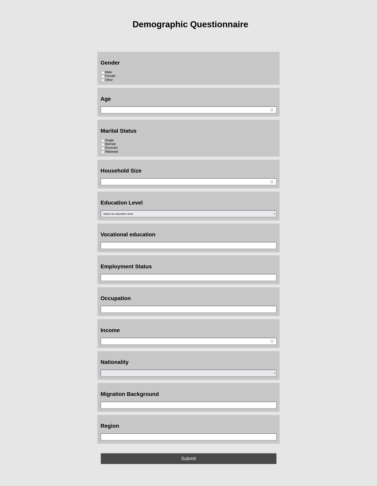
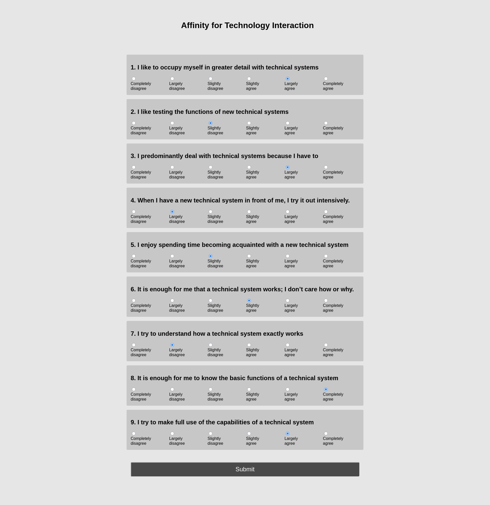
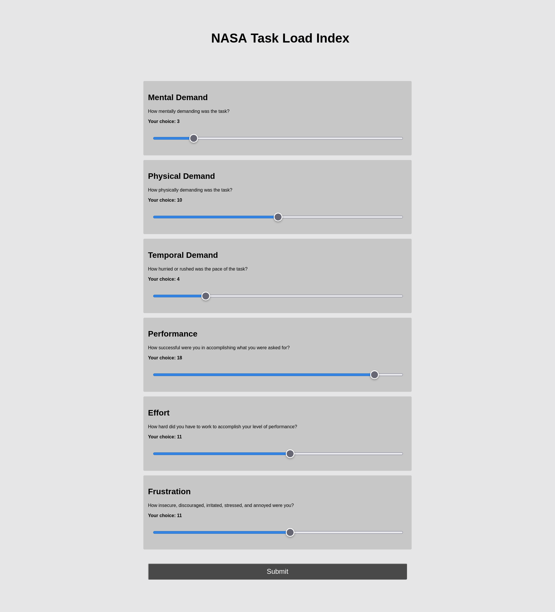

# Installation and Setup
[Intallation and setup guidelines for Fedora, Ubuntu and Windows 11](https://github.com/FiedlerInformatics/phishing-study/blob/main/installation.md)

# Frontend

# Surveys

